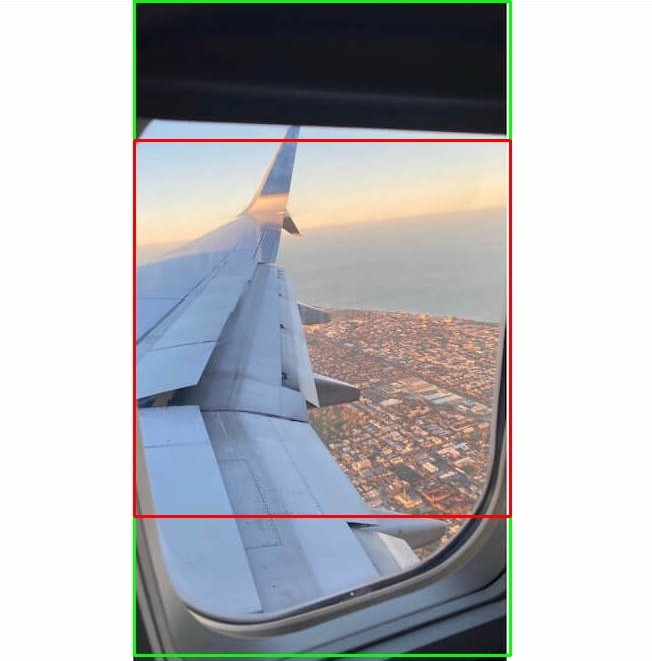
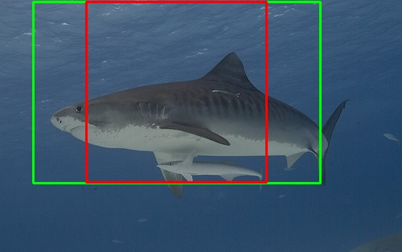
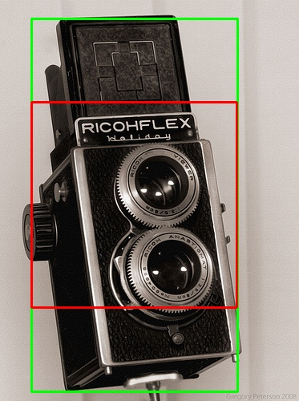

[](https://choosealicense.com/licenses/mit/)

# Cropper

A brief description of what this project does and who it's for

## Usage/Examples

```bash
python cropper.py --folder_path -crop -squared
```

## Installation

```bash
pip install -r requirements.txt
```

## Features

- Plot boundry boxes without cropping
- Squared cropping
- White border cropping

## Screenshots

<p align="center">
  </br>
  </br>
  </br>
</p>

## Contributing

Contributions are always welcome!
